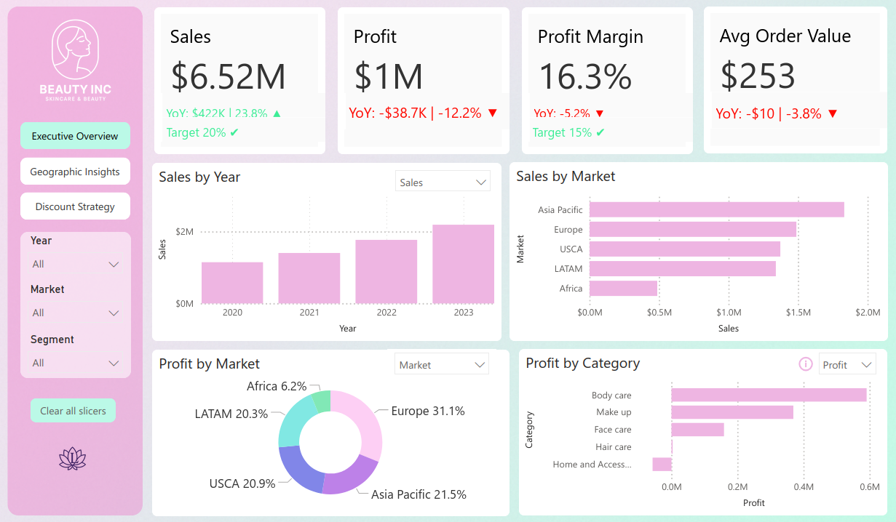

# Beauty & Skincare E-Store Report

## 📖 Project Overview
This project analyzes sales volumes and profitability for a **global skincare and beauty e-store**.  
The business case (provided by [ZoomCharts](https://zoomcharts.com/en/microsoft-power-bi-custom-visuals/challenges/fp20-analytics-september-2024)) set the following strategic goals:
- Achieve an **average annual profit margin of 15%** across all product groups  
- Reach **20% annual overall sales growth**, with a higher target of **30% for the corporate segment**  
- Ensure **at least $400K annual sales per market**  

The report highlights whether these KPIs were met and provides actionable insights into **profitability, discount strategy, and geographic performance**.  

---

## Key Insights
- **Profit Margin Trends** → Overall profit margin for all years was above the 15% target in later years, but fell from being consistently above 24% for 2020, 2021, 2022, to 16% in 2023
- profit increased every year but fell in 2023 w a yoy of ~17%
- despite sales rising every year (sales yoy in 2023 was 19.9%)-> meaning costs raised in 2023
- overall sales growth target of 20% was met in 2021 and 2022 (both years above 26%) but not met in 2023
- average order value increased in 2021 and 2022, but fell in 2023 by 12 dollars
- asia pacific largest market by sales (throughout all years), with africa consistently being the last
- asia pacific roughly ~4x bigger than africa in 2023 (sales)
- 
- africa was the only market to not meet 400k goal in 2023
- first market to reach 400k goal was asia pacific in 2022, no other market in any of the other years met this goal
- 
- europe the fastest growing market (sales), usca the slowest
- asia pacific largest in sales, but europe most profitable
- across all ears, europe has the highest profit margin (22%), asia pacific the lowest (13%)
- profit margin for all markets fell in 2023
- africa and europe was the only market where profit did not fall in 2023
- corporate > consumer > self-employed shares of profits throughout all years and markets
- **Discount Strategy** → Non-discounted products consistently outperformed discounted items, showing discounts eroded profitability.  
- **Sales Growth** → Overall sales grew close to target, but the corporate segment exceeded expectations, surpassing the 30% growth goal.  
- **Market Performance** → Not all regions achieved the $400K annual sales target, highlighting potential growth opportunities.  

---

## Report Pages

### Executive Overview

### Geographic Insights

### Discount Strategy

*(See `/images/` folder for additional report screenshots including drillthroughs and tooltips.)*  

---

## Tools & Skills Demonstrated
- Power BI Desktop  
- DAX (calculated measures for profit margin, YoY growth, sales splits)  
- Report design & storytelling (executive summary, geographic deep-dive, discount analysis)  
- Drillthrough, tooltips, and interactive slicers  

---

## Files
- `beauty-skincare-report.pbix` → Full interactive Power BI file  
- `beauty-skincare-report.pdf` → Static export for quick review  
- `/images/` → Screenshots of the report pages  

---

## Source
Dataset and business brief provided by [ZoomCharts Analytics Challenge, September 2024](https://zoomcharts.com/en/microsoft-power-bi-custom-visuals/challenges/fp20-analytics-september-2024).
